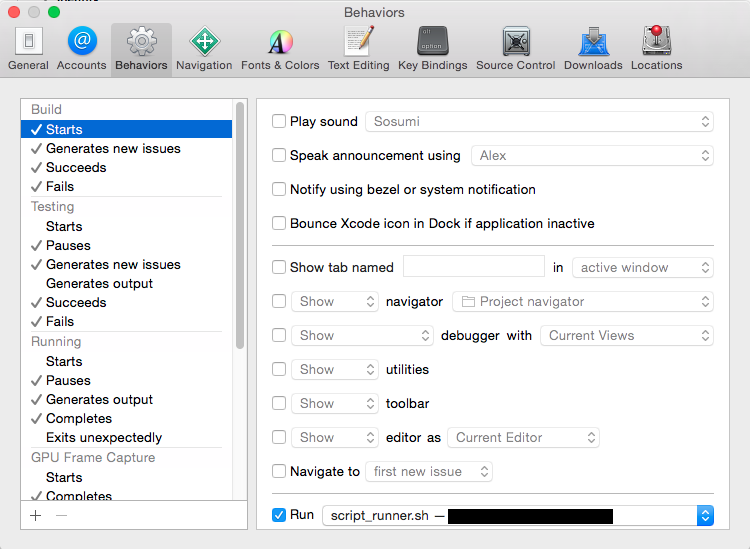

# Scripton

Do you have long build time in xCode? Do you want to learn German language? This script is for you. It allows developer to learn german words during the building time, 10 new words (German-English) a day.

## Requirements

- Xcode 6.3+

## Installation

Install `gems`:

```ruby
gem install pry
gem install uri
```

Install `mpg123`:

```ruby
brew install mpg123
```

## How

1) Create a folder in your Mac, where you will copy `script.rb`, `script_runner.sh`, `script_ender.sh`<br />
2) Open `script_runner.sh` and change path to your local path to ruby script in line<br />

```
ruby HERE_SHOULD_BE_YOUR_PATH/ruby_1.rb
```
3) Open `script_ender.sh` and do the same with path in line 

```
process_id=`ps aux|grep "ruby HERE_SHOULD_BE_YOUR_PATH/ruby_1.rb"|grep -v grep | awk '{ print $2 }'`
```
4) Open `XCode`<br />
5) Go to `Preferences`<br />
6) Select `Behaviours` tab and in `Build` section select `Start`. Check checkbox `Run` and select `script_runner.sh`<br />
7) In `Build` section select `Succeeds`. Check checkbox `Run` and select `script_ender.sh`. Do the same for `Fails`.<br />

Than run the project and enjoy German words.

## Example



##Note

It is possible also translate to such languages:

- german-english
- german-chinese
- german-french
- german-italian
- german-polish
- german-portuguese
- german-russian
- german-spanish
- german-swedish
- german-turkish

To translate to differnt language do the following:<br />

Open `script.rb` and paste in line `23` version of tranlation you need instead of `german-english`

```
url = 'http://en.bab.la/dictionary/german-english/' + word
```

Other languages will be supported soon.

##Important

If script does not stop when you expected, go to terminal and run the `script_ender.sh` script there.

##Acknowledgements

Scripton is using amasing website http://bab.la to get translation to all words that are used in the application.
Great thanks to contributor [Yunus Eren Guzel](https://github.com/yunuserenguzel) who made a server side of the project.
